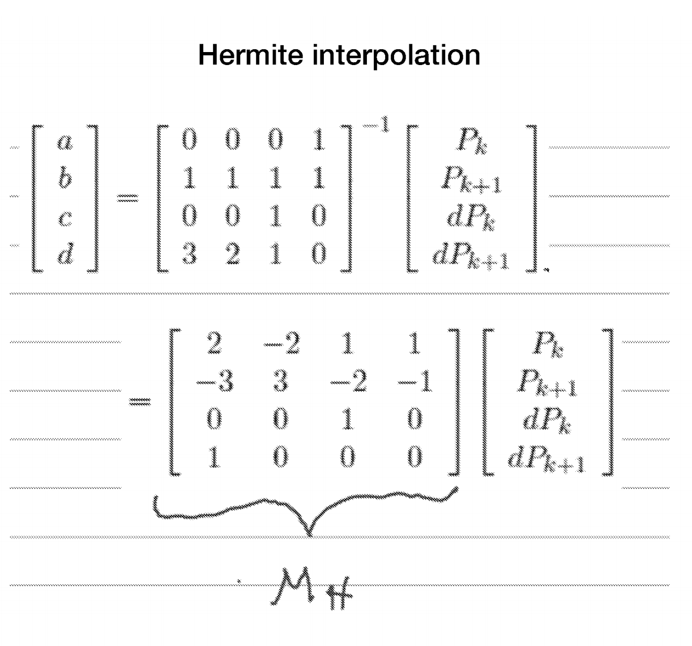
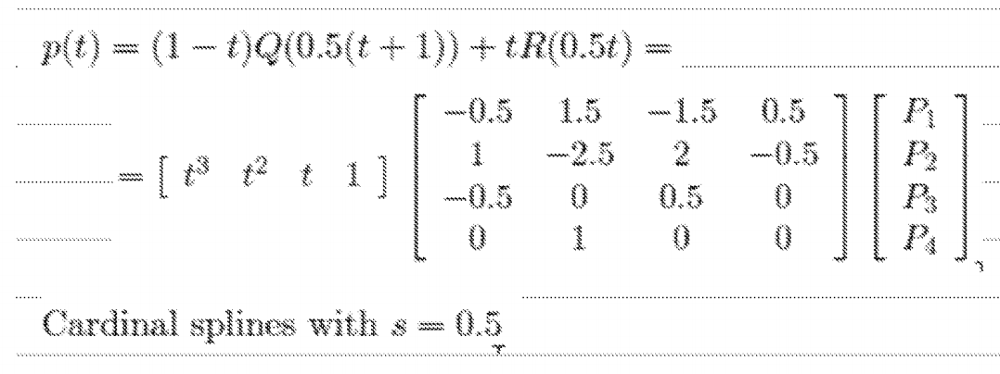
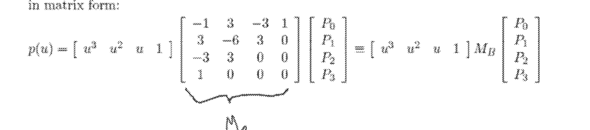

# Code documentation
It appears there was only one function I needed to do for this assignment.

### Function `interpolate(pk_n1,pk, pk_p1, pk_p2)`

I defined two arrow functions in order to operate on coordinates
```js
  // multiply a point by a constant value
  const mul_pv = (p,v) => ({ x: p.x * v, y: p.y * v });
  // find total of list of points
  const sum_pts = pts => pts.reduce((a, v) => ({ x: a.x + v.x, y: a.y + v.y }), { x: 0, y: 0 });
```

I then defined my blending functions as those for a cardinal spline curve
```js
  // blending functions
  const s = tension;
  const bFns = [
    u => -s * Math.pow(u, 3) + 2 * s * Math.pow(u, 2) - s * u,
    u => (2 - s) * Math.pow(u, 3) + (s - 3) * Math.pow(u, 2) + 1,
    u => (s - 2) * Math.pow(u, 3) + (3 - 2 * s) * Math.pow(u, 2) + s * u,
    u => s * Math.pow(u, 3) - s * Math.pow(u, 2),
  ];
```

I then made another function that uses the blending functions to generate a specific point for a given u value
```js
  const spline = u => 
    sum_pts([
      mul_pv(pk_n1, bFns[0](u)),
      mul_pv(pk, bFns[1](u)),
      mul_pv(pk_p1, bFns[2](u)),
      mul_pv(pk_p2, bFns[3](u)),
    ]);
```

Then using the spline function I generated a list of points with the desired precision
```js
  for (let u = 0; u <= 1; u += uStep) {
    const { x, y } = spline(u);
    intrPts.push(x);
    intrPts.push(y);
  }
```


# Questions
- a. 
    - parametrize line:
        - x(u) = 1 + u * (4 - 1)
        - y(u) = 1 + u * (7 - 1)
    - substitute u
        - x(0.3) = 1.9
        - y(0.3) = 2.8
        - P = (1.9, 2.8)

- b. 
    - Parametric Continuity (C):
        - identical tangents 
    - Geometric Continuity (G):
        - proportional tangents
    - Piecewise interpolation:
        - need to generate tangenets
            - con: higher computation costs
            - pro: don't have to specify tangents
        - passes through given control points
            - pro: this is important for ie - representing data

- c. using this formula from the slides and my graphing calculator I arrived at the point: (1.375, 1.625)

- d. modified code from assignment to solve this
    ```js
    Welcome to Node.js v12.9.1.
    > const s = 0.5, pk_n1 = {x:1,y:1}, pk = {x:2,y:2}, pk_p1 = {x:4,y:2}, pk_p2 = {x:5,y:1}, 
    ... 	mul_pv = (p,v) => ({ x: p.x * v, y: p.y * v }), 
    ... 	sum_pts = pts => pts.reduce((a, v) => ({ x: a.x + v.x, y: a.y + v.y }), { x: 0, y: 0 });
    > const bFns = [
    ... 	u => 2 * Math.pow(u, 3) - 3 * Math.pow(u, 2) + 1,
    ... 	u => -2 * Math.pow(u, 3) + 3 * Math.pow(u, 2),
    ... 	u => Math.pow(u, 3) - 2 * Math.pow(u, 2) + u,
    ... 	u => Math.pow(u, 3) - Math.pow(u, 2),
    ... ];
    > const spline = u => 
    ... 	sum_pts([
    ... 		mul_pv(pk_n1, bFns[0](u)),
    ... 		mul_pv(pk, bFns[1](u)),
    ... 		mul_pv(pk_p1, bFns[2](u)),
    ... 		mul_pv(pk_p2, bFns[3](u)),
    ... 	]);
    > spline(0.5)
    { x: 1.375, y: 1.625 }
    ```
- e. 
- f. using this formula from the slides and my graphing calculator I arrived at the point: (3, 2.125)
    
- g. modified code from my assignment to do this
    ```js
    Welcome to Node.js v12.9.1.
    > const s = 0.5, pk_n1 = {x:1,y:1}, pk = {x:2,y:2}, pk_p1 = {x:4,y:2}, pk_p2 = {x:5,y:1}, 
    ... 	mul_pv = (p,v) => ({ x: p.x * v, y: p.y * v }), 
    ... 	sum_pts = pts => pts.reduce((a, v) => ({ x: a.x + v.x, y: a.y + v.y }), { x: 0, y: 0 });
    > const bFns = [
    ... 	u => -s * Math.pow(u, 3) + 2 * s * Math.pow(u, 2) - s * u,
    ... 	u => (2 - s) * Math.pow(u, 3) + (s - 3) * Math.pow(u, 2) + 1,
    ... 	u => (s - 2) * Math.pow(u, 3) + (3 - 2 * s) * Math.pow(u, 2) + s * u,
    ... 	u => s * Math.pow(u, 3) - s * Math.pow(u, 2),
    ... ];
    > const spline = u => 
    ... 	sum_pts([
    ... 		mul_pv(pk_n1, bFns[0](u)),
    ... 		mul_pv(pk, bFns[1](u)),
    ... 		mul_pv(pk_p1, bFns[2](u)),
    ... 		mul_pv(pk_p2, bFns[3](u)),
    ... 	]);
    > spline(0.5);
    { x: 3, y: 2.125 }
    ```
- h. using this formula from the slides and my graphing calculator I arrived at the point (3, 1.75)
    
- i.
    ```js
    Welcome to Node.js v12.9.1.
    > const s = 0.5, pk_n1 = {x:1,y:1}, pk = {x:2,y:2}, pk_p1 = {x:4,y:2}, pk_p2 = {x:5,y:1}, 
    ... 	mul_pv = (p,v) => ({ x: p.x * v, y: p.y * v }), 
    ... 	sum_pts = pts => pts.reduce((a, v) => ({ x: a.x + v.x, y: a.y + v.y }), { x: 0, y: 0 }),
    ... 	fac = n => n < 2 ? 1 : fac(n - 1) * n,
    ... 	c = (n,k) => fac(n) / (fac(k) * fac(n - k)),
    ... 	bbfn = (n, k, u) => c(n,k) * Math.pow(u, k) * Math.pow(1 - u, n - k);
    > const bFns = [
    ... 	u => bbfn(3, 0, u),
    ... 	u => bbfn(3, 1, u),
    ... 	u => bbfn(3, 2, u),
    ... 	u => bbfn(3, 3, u),
    ... ];
    > const spline = u => 
    ... 	sum_pts([
    ... 		mul_pv(pk_n1, bFns[0](u)),
    ... 		mul_pv(pk, bFns[1](u)),
    ... 		mul_pv(pk_p1, bFns[2](u)),
    ... 		mul_pv(pk_p2, bFns[3](u)),
    ... 	]);
    > spline(0.5)
    { x: 3, y: 1.75 }
    ```
- j. We must add the control point along same vector in order to maintain C1 continuity, giving us a controlpoint of (6, 0)
    - dx = 5 - 4 = 1
    - dy = 1 - 2 = -1
    - x = 5 + dx = 6
    - y = 1 + dx = 0
    - (x, y) = <b>(6, 0)</b>
- k. bernstein polynomials allow us to create a bezier curve from as many points as we have instead of having to break it up into components. 
- l. 
- m. 