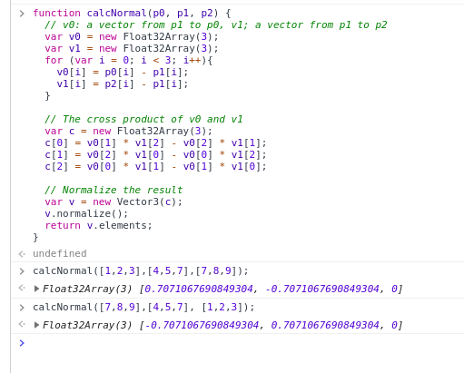
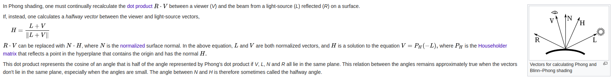

# Programming
- I chose to use my assignment5 code as a base to build off to reduce additional documentation required
- I added vertex shader variables for all the things I'd need
- I added sliders
    - for each slider I overloaded the `oninput` function to update the corresponding shader variable
- I updated the uniform variables in the drawScene function
- I used colors to debug my math in vertex shader but commented the colors out in order to match what the spec required
- I translated the calculations from the presentation into GLSL for the vertex shader program

# Questions
- 1.a. in vertext shader:
    - fixed location: transforming light with the model view matrix
    - move with camera: don't transform light
- 1.b.
- 1.c. L dot N
- 1.d.
- 1.e. `<-0.707, 0.707, 0>` 
- 1.f.
- 1.g. You can normalize(L+V) in order to approximate R dot V where the variables have the following meaning
    - R:
    - V: Viewer
    - L: Light beam
    - H: halfway vector

  this section form the Blinn–Phong wikipedia page reflection model describes the process in more detail. 
- 1.h.
    - distant light source: can use directional light instead of positional
    - distant viewer: resolution will be low, so can probably drop specularity calculations
- 1.i. ambient light doesn't have vectors that can be refracted/reflected as it is a property of the material and not the environment.
- 1.j.
- 1.k. the main difference is that there are different material properties that are factored into rendering the model
    - Gouraud: liner interpolation, quick, unrealistic, limited material diversity
    - Phong: more computations, more realistic, more complicated, more properties associated with material allow more accurate representations
- 1.l.
- 1.m. using vertex normals allows linear interpolation to be done in between verticies in the object, whereas using face normals results in flat shading and makes the boundaries between faces clear
    - to calculate vertex normals from face normals you can simply, for each vertex, average together the face normals that it is a component of
        - you can see an example of this in my `initModel` function
