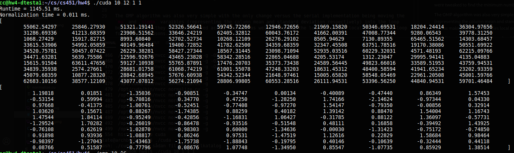

# GPU Programming
This document contains the relevant information of the README, design document and the performance evaluation.

## Usage

### Build and Run Tests
A simple makefile is used, please run it on at linux system with correctly configured nvcc.
```
$ make all     # Build
$ make test    # Run Benchmark
```

### Binary Usage
The makefile produces 3 binaries: `serial`, `omp`, and `cuda`. In order to change the behavior of the serial implementation the source must be edited directly and recompiled.

#### Using the CUDA binary
```
USAGE: ./cuda <N> <blocks> <threads per block> <seed>
N - matrix dimension
blocks - number of gpu blocks to use
threads per block - threads to allocate per block
seed - random seed
```

#### Using the omp binary
```
USAGE: ./omp <N> <#threads> <seed>
N - matrix dimension
#threads - number of CPU threads to use
seed - random seed
```

### Notice on CUDA
For my particular system I also had to do the following, replacing `nvcc` in the `Makefile` with `/opt/cuda/bin/nvcc` however this was not found to be a problem on the Chameleon Ubuntu instance.
```
$ export CUDA_PATH=/opt/cuda/
$ /opt/cuda/bin/nvcc
```

## Algorithm Overview
The algorithm is a simple parallization of the top loop such that the calculations for each column is done in a separate thread. There are some wasted threads in the GPU version but those were not found to have a significant impact on performance, regardless the numbers were tweaked to find the minimum number of blocks needed.

The OMP algorithm was also very simple with the only change versus the serial implementation being moving the `mu` and `sigma` varaibles (representing the column mean and standard deviation respectively) into the loop body such that they were not shared across threads as well as making the loop variables local only to the loop for similar reasons.

In addition to the relatively minor algorithmic changes the programs were modified to accept important values (notably - matrix size, scaling dimensions, and random seed) in order to better proove correctness and study the relevant performance characteristics.

## Proof of Correctness
The Various implementations were found to consistently produce the same results for same random seeds and small N. With the serial implementation being provided it would stand that they must all have correct algorithms.



## Testing Environment
The testing environment was a baremetal ChameleonCloud p100 node running ubuntu 20.04 and using GCC 9.3.0.


## Performance Results
As you can see from the graph shown, the simple parallel CPU algorithim demonstrated scaling down to 12 threads at which point performance results became worse. The CUDA algorithm performed better than the serial however the parallel CPU algorithm. Although "calculation time" for the CUDA algorithm did decrease slightly with the use of more blocks it was within the realm of variability for the tests. It's possible that the way that I measured time was incorrect and using cuda-specific benchmarking tools would have provided more meaningful and accurate results however it appears that the GPU is much better fit for these tasks than the CPU implementation and the time taken to offload the data seemed to have a baseline and scaling factor. It would make sense that data transfer would constitute a significant portion of our time as we're dealing with ~144mb of data being moved.
